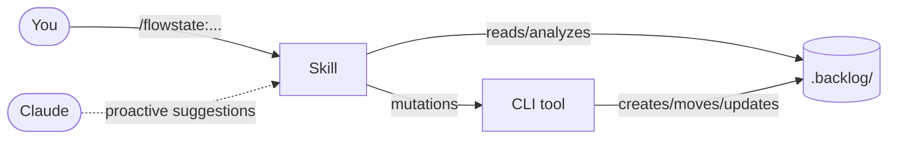
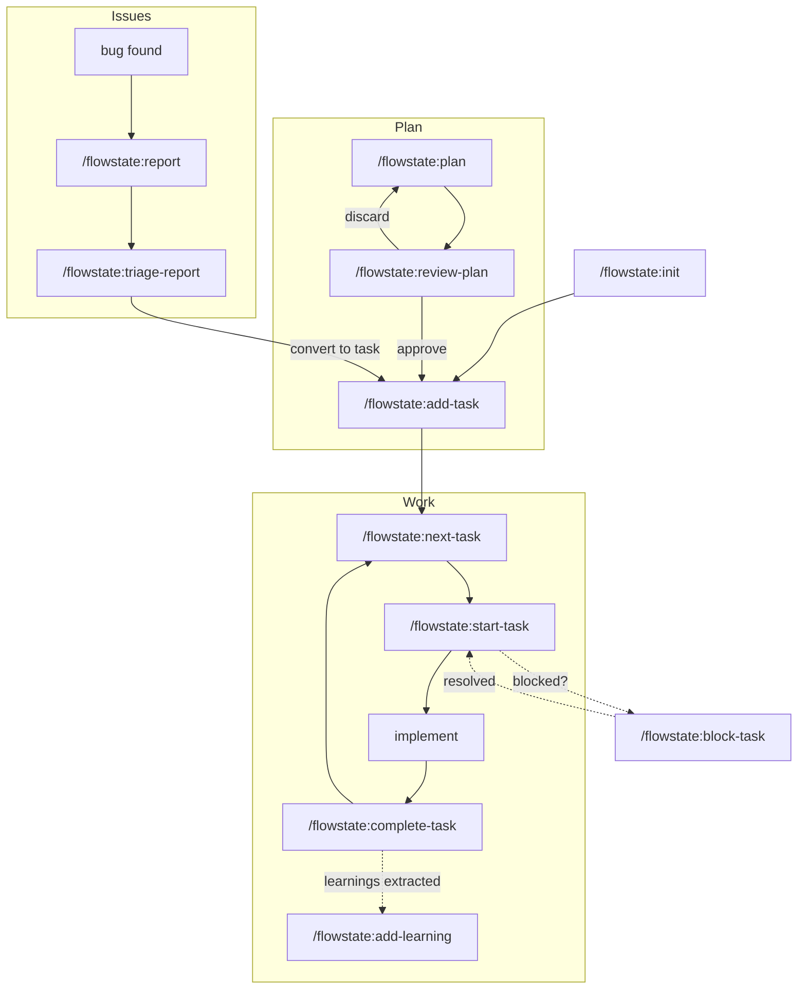
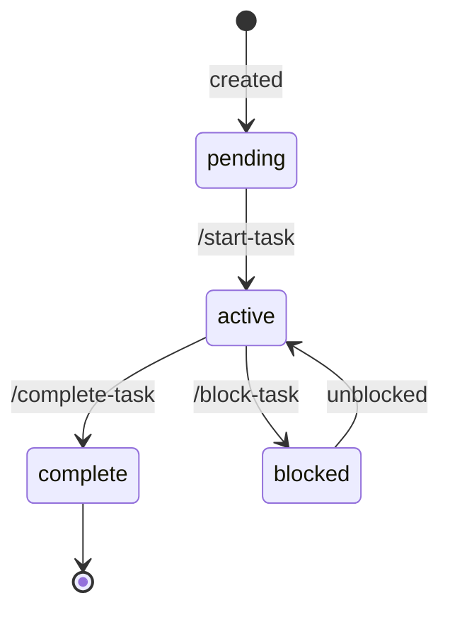
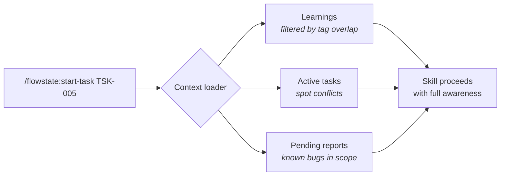
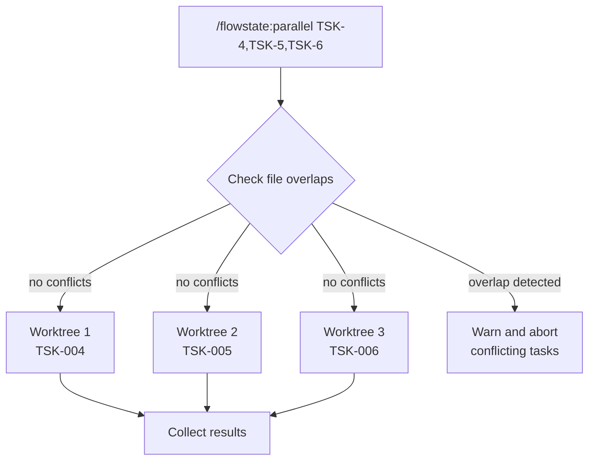

# Flowstate

> Backlog management for [Claude Code](https://docs.anthropic.com/en/docs/claude-code) — tasks, plans, reports, and learnings, all in plain markdown files.

Flowstate adds a structured, file-based backlog to any project. Everything lives in a `.backlog/` directory that you can read, edit, and commit alongside your code. Claude understands the full system and can manage the lifecycle end to end: **triage, plan, implement, learn**.

```
.backlog/
├── tasks/          # pending → active → complete
├── plans/          # pending → approved/discarded
├── reports/        # pending → triaged/discarded
└── learnings/      # searchable knowledge base
```

No external services. No databases. Just files and Git.

---

## How it works

Flowstate is a Claude Code **plugin** — once installed, it adds 15 slash commands and teaches Claude to manage your backlog proactively. Skills handle the orchestration, while a bundled TypeScript CLI performs all file mutations deterministically.



### The workflow loop



### Task lifecycle



---

## Installation

### From the marketplace (recommended)

```bash
claude plugin marketplace add jmlweb/claude-plugins
claude plugin install flowstate@jmlweb
```

### Team setup

Add the marketplace to your project's `.claude/settings.json` so everyone has access:

```json
{
  "extraKnownMarketplaces": ["jmlweb/claude-plugins"]
}
```

Then each team member runs:

```bash
claude plugin install flowstate@jmlweb
```

### Manual installation

No build step needed — `dist/` ships pre-built.

```bash
git clone https://github.com/jmlweb/flowstate-skill.git ~/.claude/plugins/flowstate
```

Or as a submodule:

```bash
git submodule add https://github.com/jmlweb/flowstate-skill.git .claude/plugins/flowstate
```

### Local development

```bash
claude --plugin-dir ./path/to/flowstate-skill
```

Use `/reload-plugins` after making changes.

---

## Quick start

```
/flowstate:init                       # create .backlog/ structure
/flowstate:add-task                   # add your first task
/flowstate:start-task TSK-001         # start working on it
# ... do the work ...
/flowstate:complete-task TSK-001      # mark it done
/flowstate:status                     # see the big picture
```

---

## Commands

### Core workflow

| Command | What it does |
|---------|--------------|
| `/flowstate:init` | Create the `.backlog/` directory structure. Safe to re-run. |
| `/flowstate:status` | Backlog overview with stats, active work, and health warnings. |

### Tasks

| Command | What it does |
|---------|--------------|
| `/flowstate:add-task` | Interactively add a task (title, description, acceptance criteria, priority, tags). |
| `/flowstate:start-task` | Move a task from pending to active. Loads relevant learnings and context. |
| `/flowstate:complete-task` | Mark a task done. Verifies acceptance criteria and extracts learnings. |
| `/flowstate:block-task` | Block a task with a documented reason. Suggests alternatives. |
| `/flowstate:check-task` | Verify a task's status matches actual implementation in the codebase. |
| `/flowstate:next-task` | Smart recommendation based on priority, dependencies, and recent work. |
| `/flowstate:parallel` | Run multiple independent tasks simultaneously in isolated git worktrees. |

### Plans

| Command | What it does |
|---------|--------------|
| `/flowstate:plan` | Generate an implementation plan — explores code, identifies risks, saves for review. |
| `/flowstate:review-plan` | Approve (converts to task), discard, or revise a pending plan. |

### Reports

| Command | What it does |
|---------|--------------|
| `/flowstate:report` | File a structured bug report, finding, or security issue. |
| `/flowstate:triage-report` | Convert a pending report to a task, discard it, or request more info. |

### Learnings

| Command | What it does |
|---------|--------------|
| `/flowstate:add-learning` | Document an insight or lesson discovered during development. |
| `/flowstate:learnings` | Browse and search the learnings index. |

---

## Backlog structure

```
.backlog/
├── tasks/
│   ├── pending/              # TSK-001-add-auth.md
│   ├── active/               # TSK-003-fix-pagination.md
│   ├── complete/             # TSK-002-setup-ci.md
│   └── index.md              # auto-generated stats
├── plans/
│   ├── pending/              # PLN-001-api-redesign.md
│   └── complete/
├── reports/
│   ├── pending/              # RPT-001-memory-leak.md
│   └── complete/
└── learnings/
    ├── index.md              # searchable index
    └── LRN-001-cache-gotcha/ # individual entries
        └── index.md
```

Every file uses YAML frontmatter for metadata and markdown for content:

```markdown
---
id: TSK-001
title: Add user authentication
status: pending
priority: P2
tags: [backend, auth]
created: 2026-04-05
depends-on: []
---

# Add user authentication

## Description
Implement JWT-based auth for the API.

## Acceptance Criteria
- [ ] Login endpoint returns a valid JWT
- [ ] Protected routes reject unauthenticated requests
- [ ] Token refresh works within the expiry window
```

### ID format

| Type | Format | Example |
|------|--------|---------|
| Task | `TSK-XXX` | `TSK-001` |
| Plan | `PLN-XXX` | `PLN-003` |
| Report | `RPT-XXX` | `RPT-007` |
| Learning | `LRN-XXX` | `LRN-002` |

### Priority levels

| Level | Meaning |
|-------|---------|
| **P1** | Critical — blocking other work |
| **P2** | High — do next |
| **P3** | Normal backlog |
| **P4** | Nice to have |

---

## Context-aware skills

Skills that involve starting or planning work automatically load relevant context before acting:



If nothing relevant is found, the skill proceeds silently. The goal is **zero-effort awareness** — the backlog informs the work automatically.

Affected skills: `start-task`, `next-task`, `plan`, `parallel`.

---

## Proactive behavior

Claude suggests Flowstate commands when relevant — you don't always need to invoke them manually:

| Situation | Claude suggests |
|-----------|-----------------|
| Discovers a bug while working | `/flowstate:report` |
| Learns something non-obvious | `/flowstate:add-learning` |
| Starting a complex feature | `/flowstate:plan` |
| Finishes work on a task | `/flowstate:complete-task` |
| Before starting work | Reads learnings to avoid past mistakes |

---

## Parallel execution

Run independent tasks simultaneously in isolated git worktrees:

```
/flowstate:parallel TSK-004,TSK-005,TSK-006
```



Each subagent works in isolation. Results are collected when all tasks finish.

---

## Architecture

```
flowstate-skill/
├── .claude-plugin/
│   └── plugin.json           # plugin manifest
├── skills/                   # 15 slash commands (SKILL.md each)
├── hooks/
│   ├── hooks.json            # event handlers
│   ├── on-test-failure.sh    # suggests /flowstate:report
│   └── pre-commit-reminder.sh
├── src/                      # TypeScript source
│   ├── bin/flowstate.ts      # CLI entry point
│   ├── commands/             # CRUD operations
│   └── core/                 # types, frontmatter, paths, etc.
├── dist/                     # pre-built JS (ships with the plugin)
├── references/               # templates and docs
├── SKILL.md                  # plugin-level context for Claude
└── README.md
```

The plugin follows a clear separation of concerns:

- **Skills** (markdown) handle orchestration — they tell Claude *what* to do
- **CLI** (TypeScript) handles mutations — it *does* the file operations deterministically
- **Hooks** handle proactive triggers — they fire on events like test failures

---

## License

MIT — see [LICENSE](LICENSE).

---

Made by [jmlweb](https://github.com/jmlweb).
